# Aaron Ruiz Mora - Graphics & Rendering Engineer ⚡
> Real-time Rendering | Unreal Engine 5 | C++ | DirectX | Vulkan 🎮

Hi! This is my personal GitHub where I share projects focused on real-time graphics, game development and C++. Feel free to explore and interact with my repositories!

 My contributions to [Open 3D Engine (O3DE)](https://github.com/o3de/o3de) while I worked in Amazon's *Game Engine and Developer Services* team can be found on my [moraaar](https://github.com/moraaar) account.

 Learn more about my professional career on [LinkedIn](https://www.linkedin.com/in/aaron-ruiz-mora-5621526/)

### 👀 What you'll find here
- Real-time rendering learning projects (Vulkan, DirectX).
- Unreal Engine 5 courses and experiments.
- C++ and graphics reminders and cheatsheets.
- University game projects.

<!--
**AaronRuizMoraUK/AaronRuizMoraUK** is a ✨ _special_ ✨ repository because its `README.md` (this file) appears on your GitHub profile.

Here are some ideas to get you started:

- 🔭 I’m currently working on ...
- 🌱 I’m currently learning ...
- 👯 I’m looking to collaborate on ...
- 🤔 I’m looking for help with ...
- 💬 Ask me about ...
- 📫 How to reach me: ...
- 😄 Pronouns: ...
- ⚡ Fun fact: ...
- 🎮 🎲♟🎯🔧🕹

-->

<!-- Stats -->

<!--

-->

<!-- Pinned projects -->
## Graphics

<!--

](https://github.com/AaronRuizMoraUK/Vulkan-Course)
](https://github.com/AaronRuizMoraUK/DirectX11-Course)
](https://github.com/AaronRuizMoraUK/DirectX12-Resources-Cheatsheet)
[Vulkan Course](https://github.com/AaronRuizMoraUK/Vulkan-Course)
[DirectX11 Course](https://github.com/AaronRuizMoraUK/DirectX11-Course)
[DirectX12 Resources Cheatsheet](https://github.com/AaronRuizMoraUK/DirectX12-Resources-Cheatsheet)
-->

## Unreal Engine

<!--
](https://github.com/AaronRuizMoraUK/UE5_SimpleShooter)
](https://github.com/AaronRuizMoraUK/UE5_ToonTanks)
](https://github.com/AaronRuizMoraUK/UE5_CryptRaider)
](https://github.com/AaronRuizMoraUK/UE5_ObstacleAssault)
[UE5 Simple Shooter](https://github.com/AaronRuizMoraUK/UE5_SimpleShooter)
[UE5 Toon Tanks](https://github.com/AaronRuizMoraUK/UE5_ToonTanks)
[UE5 Crypt Raider](https://github.com/AaronRuizMoraUK/UE5_CryptRaider)
[UE5 Obstacle Assault](https://github.com/AaronRuizMoraUK/UE5_ObstacleAssault)
-->

## Open 3D Engine

<!--
](https://github.com/AaronRuizMoraUK/O3DE_CourseProject)
[O3DE Course Project](https://github.com/AaronRuizMoraUK/O3DE_CourseProject)
-->

## University

<!--
](https://github.com/AaronRuizMoraUK/GalaxyScraper)
](https://github.com/AaronRuizMoraUK/TV3MarathonGame)
[Galaxy Scraper](https://github.com/AaronRuizMoraUK/GalaxyScraper)
[TV3 Marathon Game](https://github.com/AaronRuizMoraUK/TV3MarathonGame)
-->

## C++

<!--
](https://github.com/AaronRuizMoraUK/cxx-reminder)
[C++ Reminder](https://github.com/AaronRuizMoraUK/cxx-reminder)
-->
